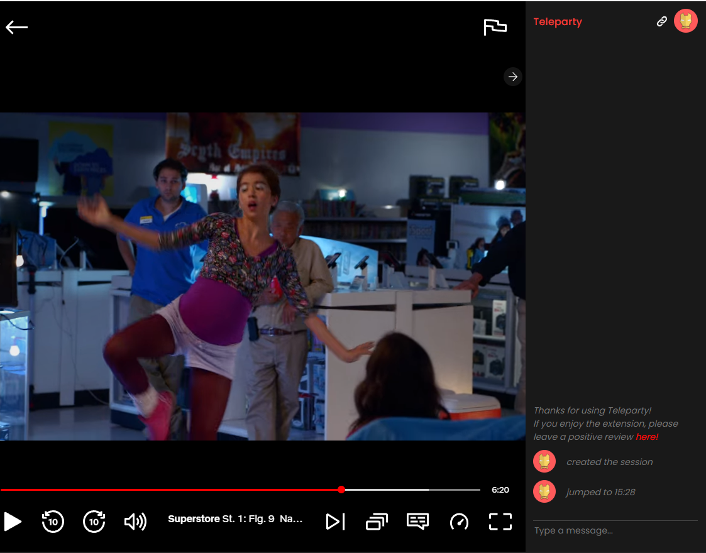
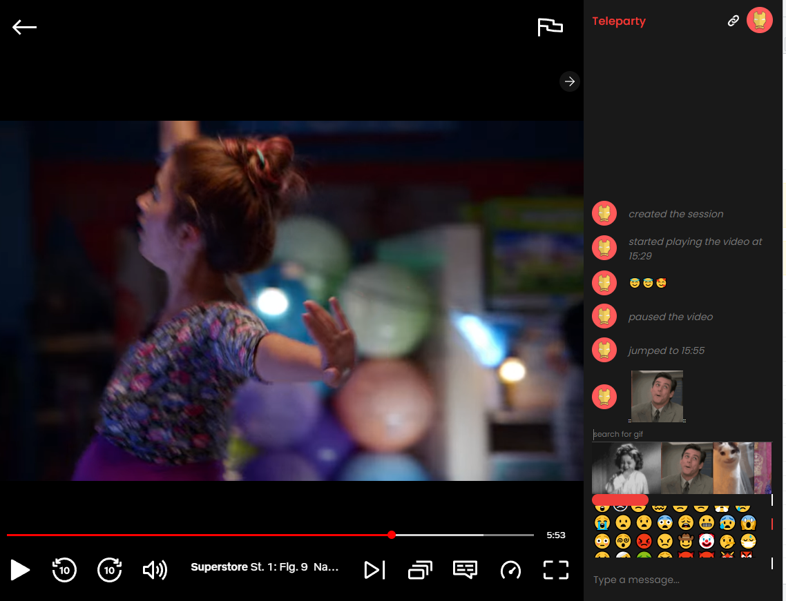
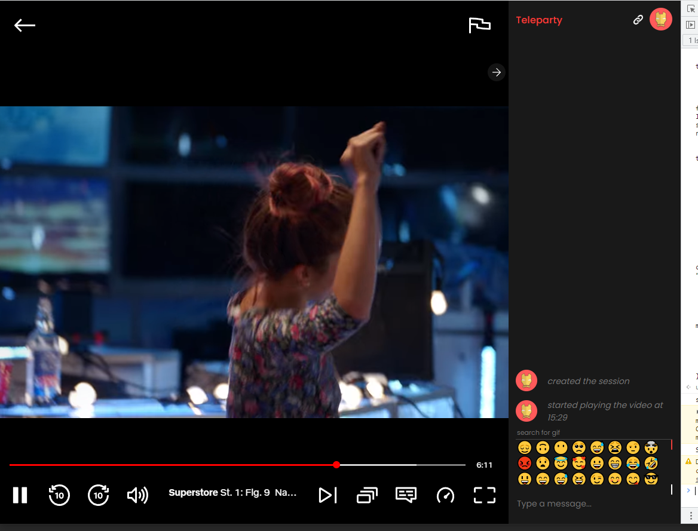

# TeleParty Booster
## Gif & Emoji Support
### How to run:
npm run build:app 
Go to netflix, load TeleParty, open devtools, copy content from dist/app.js, insert and hit enter.

### Original ( boosted screens below )

### Boosted
#### Gif Support 

#### Emoji Suppot

